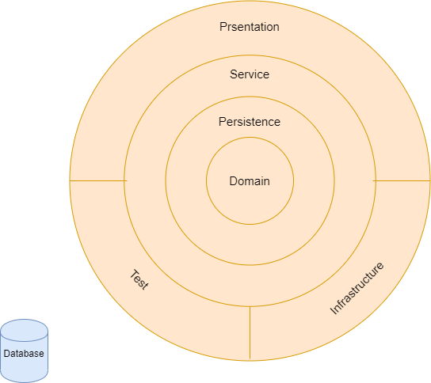

# SPRING WEB WITH CLEAN ARCHITECTURE

COMMIT BY COMMIT IMPLEMENTATION OF A SPRING WEB APP THAT IMPLEMENTS DDD WIT ONION ARCHITECTURE

Implementation will follow this specific onion architecture (since some keep repositories at the outmost layer):

Notes: for technical documentation/guides have a look [here](docs-resources/TECH-DOC.md)
